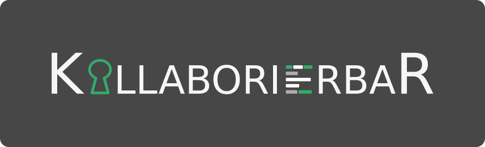

<p align="center">
	
</p>

[](http://hudson.se.informatik.tu-darmstadt.de/job/BP-KollaborierbaR/)

*KollaborierbaR* is a web-based IDE for collaboratively editing Java source code and running automated proofs of [JML](https://en.wikipedia.org/wiki/Java_Modeling_Language) specifications. *KollaborierbaRs* automated proof system is based on the [KeY project](https://www.key-project.org/).

# Demo

[This demo](https://drive.google.com/file/d/1jp2eqVL_bvdBjCZ73btnlBK_Xx-cg6N2/view?usp=sharing) presents some of the basic features of KollaborierbaR:

<p align="center">
  <a href="https://drive.google.com/file/d/1jp2eqVL_bvdBjCZ73btnlBK_Xx-cg6N2/view?usp=sharing">
    
  </a>
</p>

# Quickstart 🚀

(requires python3 for running a local webserver and Java 8 for running the backend. Versions other than Java 8 **will lead to errors**.)

1. Download the latest `KollaborierbaR.tar.gz` from [releases](https://github.com/tdelta/KollaborierbaR/releases/)
2. **OR** build an up to date version yourself:

```sh
make setup
make deploy
cd deliverables
```

3. Extract the archive and run KollaborierbaR
```
tar -xf KollaborierbaR.tar.gz
cd KollaborierbaR
./run.sh
```

4. If you want others to join you in KollaborierbaR, stop the server, configure your public IP address in `config.js`, and restart it.

# Documentation :closed_book:

A description of the project, QA methods, two user studies and a documentation of the backend API can be found in this document:
[documentation.pdf](./documentation.pdf).
It is written for the most part in German, though. The backend API specification is written in English.

Other than that, the source code itself is annotated with comments and documentation in English.

# KollaborierbaRs build system 🛠️

KollaborierbaR consists of 2 components, a web frontend (located in the `client` folder) and a backend server (see `server` folder).

A set of makefiles abstracts from the different tooling used in those projects. The following `make` commands are available:


|command        |effect                                                                   |
|---------------|-------------------------------------------------------------------------|
|`make setup`   |Download all dependencies required for building KollaborierbaR           |
|`make check`   |Run style checks and static analysis tools                               |
|`make`         |Build client and server                                                  |
|`make test`    |Run tests on the server API                                              |
|`make pipeline`|Run all of the above                                                     |
|`make deploy`  |Build a tar.gz archive, which makes it easy to distribute KollaborierbaR |
|`make format`  |Run automatic code formatters                                            |
|`make clean`   |Clean build artifacts                                                    |

**Remember to always run `make setup` first, after downloading the repository**

You can use all of the above commands (except for `deploy`) also within the `client` or `server` folders, so that the described effects only apply to the client or server respectively.

# Credits

The KollaborierbaR IDE has been developed by

* Jonas Belouadi - [@potamides](https://github.com/potamides)
* Marc Arnold - [@m-arnold](https://github.com/m-arnold)
* Martin Kerscher - [@maruker](https://github.com/maruker)
* David Heck - [@heckstrahler](https://github.com/heckstrahler)
* Anton Haubner - [@ahbnr](https://github.com/ahbnr)

This project has been realized in the context of a practical lab course of the
B.Sc. Computer Science programme at [TU Darmstadt](https://www.tu-darmstadt.de/index.en.jsp).
More specifically, the project was commissioned by the
[Software Engineering Group](https://www.informatik.tu-darmstadt.de/se/homepage/index.en.jsp).

In particular we want to thank

* [Eduard Kamburjan](https://www.mn.uio.no/ifi/english/people/aca/eduard/index.html) (as SE Group supervisor, [@Edkamb](https://github.com/Edkamb))
* [Dominic Steinhöfel](https://www.dominic-steinhoefel.de/) (as SE Group supervisor, [@rindPHI](https://github.com/rindPHI))
* Tom König (as student tutor, [@tomknig](https://github.com/tomknig))

for supervising the project.
